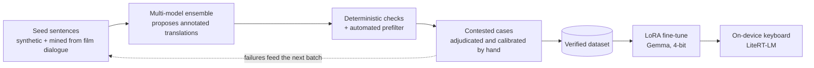

# Podtekst

**Подтекст** — *"subtext"*

An on-device Android keyboard that translates **Russian ↔ English** and flags
what a literal translation would miss: tone, formality, sarcasm, idiom,
emotional subtext. Automatically, without the user asking.

---

Fully local, with no cloud calls at runtime. Built to help two people from
different language backgrounds understand what is actually being said, not
just the words.

## What it's for

Illustrative examples of the target behaviour; the fine-tuned model isn't
trained yet.

| You type | Literal translation | Podtekst |
| --- | --- | --- |
| Какого чёрта ты тут делаешь? | What devil are you doing here? | **What the hell are you doing here?** *Idiom: a rough, surprised "what the hell", not about the devil.* |
| Вы не подскажете, где вокзал? | You will not tell me where the station is? | **Excuse me, could you tell me where the station is?** *Formal вы: polite request to a stranger.* |
| Ну ты даёшь! | Well, you give! | **Wow, you're something else!** *Exclamation of surprise or admiration, sometimes teasing.* |

When there's nothing worth flagging, no note is shown. The app never refuses
or withholds a translation; at worst a note is suppressed when the model isn't
confident.

## Progress

*Last updated 2026-09-26.*

| Phase | Status |
| --- | --- |
| Feasibility spike (base Gemma, prompt only) | ✅ Done: nuance detection works out of the box |
| Training data pipeline (synthetic + verified) | 🔄 In progress: **2,185 verified rows** (batches 1–6a) toward the 3,000-row Phase 1 target; batch 6b in progress |
| Real-dialogue mining (film audio + subtitles) | 🔄 In progress: see below |
| LoRA fine-tune (Gemma 2B → 4B) | ⏭️ Next |
| On-device conversion + benchmarking | 📋 Planned |
| Keyboard (FlorisBoard fork) + nuance UI | 📋 Planned |
| Voice input (v1.1) | 📋 Planned |

**Real-dialogue mining so far**

- **Film audio:** 76.6 hours of Russian film and series audio processed into
  **29,961 single-speaker clips (27.5 hours of speech)**. Each clip has dialogue
  separated from music, with overlapping speech and noisy stretches filtered out.
  Transcripts are machine-generated (GigaAM v3); a second engine (Whisper
  large-v3) agrees with them on 77% of clips, which serves as a confidence tier,
  not a human check.
- **Subtitles:** the OPUS OpenSubtitles RU-EN corpus is mined for lines where a
  human subtitler departed from a literal translation. Lines are limited to
  Russian-made films and filtered for broken text, and ты/вы cases are kept in
  their own capped bucket.
- Mined lines and clips are **candidates, not labels**. They seed the same
  verification pipeline as the synthetic data, and none of the media or text
  is committed to this repo.

## How it works

- **One fine-tuned model** (Gemma, LoRA, 4-bit) returns the translation and an
  optional short nuance note in a single structured output.
- **Training data** is synthetic and verified. A multi-model ensemble proposes
  annotated translations, deterministic checks and an automated prefilter
  clear the easy cases, and the contested ones are adjudicated and calibrated
  by hand. See [`data-pipeline/`](data-pipeline/), and
  [`data-pipeline/movie_mining/`](data-pipeline/movie_mining/) for the film
  and subtitle mining.
- **Runtime** is fully on-device via LiteRT-LM, chosen because its NPU path
  covers both Qualcomm Snapdragon and MediaTek Dimensity phones.

## Repository layout

| Path | What's there |
| --- | --- |
| [`data-pipeline/`](data-pipeline/) | Dataset generation and verification: seeds, model ensemble, checks, prefilter |
| [`data-pipeline/movie_mining/`](data-pipeline/movie_mining/) | Film audio → clean dialogue clips; OpenSubtitles miner |

Fine-tuning and the keyboard land here as those phases start. Detailed design, product and execution docs are kept out of this public repo.
The code and pipeline tooling here are the public part of the project.

## Built on

- [FlorisBoard](https://github.com/florisboard/florisboard) (MIT): Android keyboard base
- [LiteRT-LM](https://github.com/google-ai-edge/LiteRT-LM) (Apache-2.0): on-device
  LLM inference runtime (Kotlin API, standalone Gradle dependency)
- Data pipeline: [Demucs](https://github.com/facebookresearch/demucs) (MIT)
  dialogue separation, [Nemotron 3 Diarization](https://huggingface.co/nvidia/Nemotron-3-Diarization),
  [GigaAM v3](https://github.com/salute-developers/GigaAM) (MIT) and
  [whisper.cpp](https://github.com/ggml-org/whisper.cpp) (MIT) speech recognition,
  [OPUS OpenSubtitles](https://opus.nlpl.eu/OpenSubtitles.php) (Lison & Tiedemann, 2016)
- Planned for voice input (v1.1): [sherpa-onnx](https://github.com/k2-fsa/sherpa-onnx)
  (Apache-2.0) with GigaAM v3 for Russian speech recognition, and Android's
  built-in TextToSpeech

See [`NOTICE`](NOTICE) for full attribution.

## Why

Translation tools get the words right and the meaning wrong. Podtekst exists
to close that gap for one language pair, done well, rather than many language
pairs done shallowly.

## License

Apache License 2.0. See [`LICENSE`](LICENSE).
