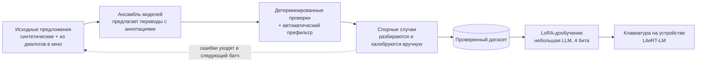

<a href="README.md">Read in English</a>

# Podtekst

**Подтекст — «subtext»**

Локальная Android-клавиатура, которая переводит с русского на английский (и обратно) и отмечает то, что теряется при дословном переводе: тон, степень формальности, сарказм, идиомы, эмоциональный подтекст. Автоматически, без дополнительных действий со стороны пользователя.

Работает полностью на устройстве, без обращений к облаку. Создана, чтобы помочь людям с разными родными языками понимать, что собеседник на самом деле имеет в виду, а не просто переводить слова.

## Что она делает

Примеры показывают целевое поведение; дообученная модель пока не готова.

| Вы пишете | Дословный перевод | Podtekst |
|---|---|---|
| Какого чёрта ты тут делаешь? | What devil are you doing here? | What the hell are you doing here? *Идиома: грубое удивлённое «what the hell», чёрт тут ни при чём.* |
| Вы не подскажете, где вокзал? | You will not tell me where the station is? | Excuse me, could you tell me where the station is? *Формальное «вы»: вежливая просьба к незнакомому человеку.* |
| Ну ты даёшь! | Well, you give! | Wow, you're something else! *Восклицание удивления или восхищения, иногда с иронией.* |

Если отмечать нечего, примечание не показывается. Приложение никогда не отказывается переводить и не скрывает перевод: в худшем случае, если модель не уверена, примечание просто не выводится.

## Прогресс

*Последнее обновление: 07.10.2026.*

| Этап | Статус |
|---|---|
| Проверка концепции (базовая Gemma, только промпт) | ✅ Готово: распознавание нюансов работает из коробки |
| Пайплайн обучающих данных (синтетика + проверка) | ✅ Цель Фазы 1 достигнута: **3 815 проверенных строк** (3 802 уникальных предложения), разделены на 3 421 обучающую и 381 тестовую; почти одинаковые предложения всегда попадают в одну часть |
| Сбор реальных диалогов (аудио из фильмов + субтитры) | 🔄 В процессе: см. ниже |
| LoRA-дообучение | 🔄 Начинается: скрипты обучения и оценки в [`model/`](model/); первый кандидат — QVikhr-3-1.7B (Qwen3, дообученная для русского языка), для сравнения — Gemma 4 E2B/E4B на тестовой выборке |
| Конвертация для работы на устройстве + бенчмарки | 📋 В планах |
| Клавиатура (форк FlorisBoard) + интерфейс примечаний | 📋 В планах |
| Голосовой ввод (v1.1) | 📋 В планах |

Проверенные строки по меткам: без нюанса 44 %, смена формальности (ты/вы) 20 %, сарказм 16 %, идиомы 15 %, эмоциональный подтекст 5 %. Эмоциональный подтекст собрать труднее всего: большинство эмоций переживают перевод, поэтому засчитываются только культурно-специфичные (обида, тоска, душевный, умиление). Отдельный проход по субтитрам за словами-эмоциями поднял эту долю с 1 % до 5 %.

### Сбор реальных диалогов: текущие результаты

- **Аудио из фильмов:** 76,6 часа звука из русских фильмов и сериалов нарезаны на 29 961 клип с одним говорящим (27,5 часа речи). В каждом клипе речь отделена от музыки, а участки с наложением голосов и шумом отфильтрованы. Расшифровки сделаны автоматически (GigaAM v3); второй движок (Whisper large-v3) совпадает с ними в 77 % клипов — это показатель уверенности, а не замена ручной проверке.
- **Субтитры:** в корпусе OPUS OpenSubtitles RU–EN ищутся реплики, где переводчик-человек отошёл от дословного перевода. Отбираются только фильмы российского производства, повреждённый текст отсеивается, а случаи с ты/вы выделяются в отдельную ограниченную выборку. Отдельный режим собирает реплики с культурно-специфичными словами-эмоциями (обида, тоска, душевный и др.) для категории эмоционального подтекста.
- **Видео с авторскими субтитрами:** интервью и подкасты, для которых авторы выложили и русские, и английские субтитры. Дорожки выравниваются с помощью LaBSE и таймингов, а английский текст, написанный человеком, сохраняется как эталонный перевод. Если субтитры есть только для одного языка, другая сторона сначала расшифровывается через whisper.cpp.
- Собранные реплики и клипы — это кандидаты, а не готовые разметки. Они проходят тот же пайплайн проверки, что и синтетические данные. Ни сами медиафайлы, ни их текст в этот репозиторий не попадают.

## Как это работает

- **Одна дообученная модель** (LoRA на модели размером 1,7–4 млрд параметров, 4 бита на телефоне; базовая модель выбирается по тестовой выборке: сначала QVikhr-3-1.7B, для сравнения Gemma 4 E2B/E4B) выдаёт перевод и, при необходимости, короткое примечание о нюансах в одном структурированном ответе.
- **Обучающие данные синтезируются и проверяются.** Ансамбль из нескольких моделей предлагает переводы с аннотациями, детерминированные проверки и автоматический префильтр отсеивают простые случаи, а спорные разбираются и калибруются вручную. Подробности — в [`data-pipeline/`](data-pipeline/), а извлечение данных из фильмов и субтитров — в [`data-pipeline/movie_mining/`](data-pipeline/movie_mining/).
- **Модель работает полностью на устройстве** через LiteRT-LM. Он выбран потому, что умеет задействовать NPU на смартфонах с Qualcomm Snapdragon и MediaTek Dimensity.

## Структура репозитория

| Путь | Что внутри |
|---|---|
| [`data-pipeline/`](data-pipeline/) | Генерация и проверка датасета: исходные предложения (seeds), ансамбль моделей, проверки, префильтр |
| [`data-pipeline/movie_mining/`](data-pipeline/movie_mining/) | Аудио из фильмов → чистые клипы с репликами; майнер OpenSubtitles; выравнивание парных субтитров |
| [`data-pipeline/voice_eval/`](data-pipeline/voice_eval/) | Оценка распознавания речи: английский с индийским акцентом (Svarah), собственные записи, русская речь против человеческих субтитров |
| [`model/`](model/) | LoRA-дообучение: общий промпт, подготовка данных, обучение, оценка, слияние для LiteRT-LM |

Код клавиатуры появится здесь, когда начнётся этот этап. Подробная документация по дизайну, продукту и реализации хранится вне этого публичного репозитория; здесь находятся код и инструменты пайплайна.

## На чём построено

- [FlorisBoard](https://github.com/florisboard/florisboard) (MIT) — основа Android-клавиатуры
- [LiteRT-LM](https://github.com/google-ai-edge/LiteRT-LM) (Apache-2.0) — среда выполнения LLM на устройстве (Kotlin API, отдельная зависимость Gradle)
- Пайплайн данных: Demucs (MIT) для отделения речи от музыки, Nemotron 3 Diarization для диаризации, GigaAM v3 (MIT) и whisper.cpp (MIT) для распознавания речи, OPUS OpenSubtitles (Lison & Tiedemann, 2016)
- Для голосового ввода (v1.1) планируются sherpa-onnx (Apache-2.0) с GigaAM v3 для русской речи и встроенный в Android TextToSpeech

Полный список атрибуций — в файле [NOTICE](NOTICE).

## Зачем

Переводчики часто правильно передают слова, но теряют смысл. Podtekst закрывает этот пробел для одной языковой пары — зато глубоко, а не поверхностно для десятков языков.

## Лицензия

Apache License 2.0. См. [LICENSE](LICENSE).
